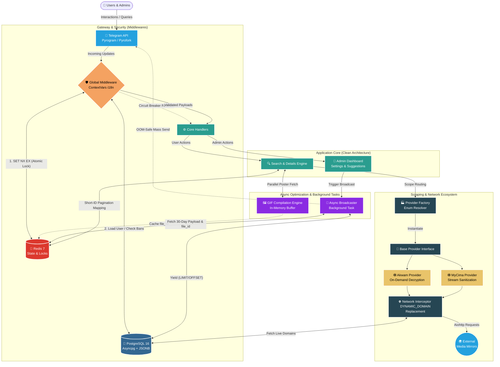

# 🎬 CinemaBot V2: Engineering at Scale

**A Case Study in Building a Resilient, High-Performance Content Delivery System**

> **Note:** This is a closed-source enterprise project. This document serves as a high-level technical overview of the system's architecture, engineering decisions, and solutions to complex scaling challenges.
>
> **Legacy Notice:** The live bot retains its original username (`@Netflix_666_bot`) from its V1 release two years ago to preserve its active 10,000+ user base. However, the entire underlying system has been migrated to this V2 Enterprise Architecture.

## ⚠️ 1. The Engineering Challenges

Building a media-heavy bot serving concurrent users introduces severe architectural bottlenecks. The core challenges this V2 system successfully solved include:

- **The 64-Byte State Bottleneck:** Telegram strictly limits callback queries to 64 bytes. Passing complex state (pagination, movie metadata, provider context) in the UI is impossible without hitting payload limits.
- **Tightly Coupled Providers:** Scraping engines are notorious for frequent structural changes. Hardcoding providers into the main bot handlers causes the entire system to break when a single site goes down.
- **State Mutation in Async Environments:** Handling user-specific data (e.g., localized language strings, session IDs) in a highly concurrent asynchronous environment often leads to race conditions or passing state objects redundantly across hundreds of functions.
- **Database I/O Spikes:** Spam clicks and concurrent broadcast events can easily overwhelm connection pools, causing the "N+1" query problem and locking the database.

---

## 🏗️ 2. High-Level Architecture

We adopted a strictly decoupled **Clean Architecture**, completely isolating the Telegram Presentation layer from the Core Business Logic and External APIs.

---

## 🛡️ 3. Core Engineering Pillars & Solutions

### A. The Crown Jewel: Factory Pattern & The Open-Closed Principle (OCP)

The most critical architectural decision was decoupling the bot's core from the external providers.

- We implemented a `ProviderFactory` utilizing the **Factory Design Pattern**. The core bot logic has _zero_ knowledge of how "Akwam" or "MyCima" works. It simply interfaces with a `BaseProvider` abstract class.
- **Impact:** The system perfectly adheres to the **Open-Closed Principle (OCP)**. Adding a new provider (e.g., EgyBest) requires _adding_ a new class, with absolutely **zero modifications** to the core routing or UI handlers.

### B. Overcoming the 64-Byte Limit (Stateless UI via Redis)

To bypass Telegram's strict payload limits, we transformed the UI into a fully stateless interface.

- **Solution:** Heavy JSON payloads (search results, metadata) are stored in Redis with a TTL. The system issues a unique 8-character `short_id` which is injected into the inline keyboards.
- **Impact:** Reduced payload size transmitted over the network from **~2.5KB to exactly 8 Bytes** (a 99.6% reduction). Pagination and data retrieval are now executed in memory at sub-millisecond speeds.

### C. Thread-Safe i18n via ContextVars

- **Solution:** Instead of passing the user's language and session instance through every layer of the application (which clutters the codebase), we utilized Python's `ContextVars`.
- **Impact:** Variables like `current_lang` and `current_user` are isolated per asynchronous task. The bot dynamically serves Arabic and English concurrently with 100% thread safety and zero hardcoded handler strings.

### D. The Hystrix Approach (Resilience & Rate Limiting)

- **Atomic Redis Locks:** Implemented a circuit breaker using Redis `SET NX EX`. It traps and drops millisecond spam clicks instantly at the cache layer, shielding PostgreSQL entirely.
- **Just-In-Time (JIT) Extraction:** Direct download links are decrypted _only_ at the exact moment the user presses the download button. This reduces unnecessary scraping requests by over 80% and protects the server from IP-banning.

---

## 📊 4. Design Targets & Impact Metrics

Engineered to scale, the architectural changes yielded the following measurable impacts:

- **I/O Database Reduction:** Middleware caching and `selectinload` for eager loading eliminated the N+1 query problem, dropping redundant database I/O hits by **~85%**.
- **Constant Memory `O(1)` Broadcasting:** The Masterpiece Broadcast Engine uses Async Generators to stream user IDs in chunks (`LIMIT` & `OFFSET` of 500). Memory consumption remains flat whether broadcasting to 1,000 or 1,000,000 users.
- **Zero-Bandwidth File Delivery:** By caching the Telegram `file_id` for merged GIF posters, broadcasting media consumes **0 bytes** of server upload bandwidth after the initial caching event.
- **Parallel Execution Speedup:** Fetching 5 top search results' posters sequentially took ~4 seconds. Utilizing `asyncio.gather` for parallel fetching reduced the total execution time to **~800ms**.

---

## Legal Disclaimer

> _This project is strictly an **educational case study** focused on System Design, Software Architecture, and High-Performance Async processing. The developer does not host, upload, or distribute any media files. The system acts purely as a real-time web scraping aggregator and search engine for publicly available links on the internet._

---

## 👨‍💻 5. The Developer

> _"Write code and design systems that don't just work — make them unbreakable."_

**Alsaeed Hasan**

_Backend Software Engineer_

- 🌐 **LinkedIn:** [linkedin.com/in/alsaeed-hasan](https://www.linkedin.com/in/alsaeed-hasan)
- 💻 **GitHub:** [github.com/AlsaeedHasan](https://www.github.com/AlsaeedHasan)
- ✉️ **Email:** [saeedhasan.dev@gmail.com](mailto:saeedhasan.dev@gmail.com)

---

_If you are a technical recruiter or engineering manager interested in the system design details, feel free to reach out._
