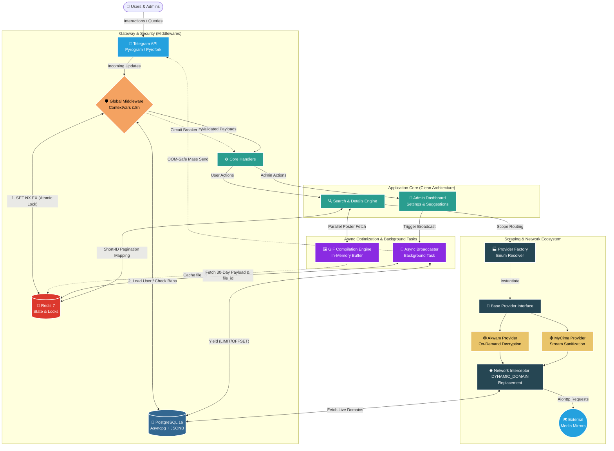

```mermaid
flowchart TB
    %% Styling & Theming
    classDef userLayer fill:#24A1DE,stroke:#fff,stroke-width:2px,color:#fff;
    classDef middleware fill:#F4A261,stroke:#fff,stroke-width:2px,color:#000;
    classDef core fill:#2A9D8F,stroke:#fff,stroke-width:2px,color:#fff;
    classDef asyncTasks fill:#8A2BE2,stroke:#fff,stroke-width:2px,color:#fff;
    classDef db fill:#336791,stroke:#fff,stroke-width:2px,color:#fff;
    classDef redis fill:#DC382D,stroke:#fff,stroke-width:2px,color:#fff;
    classDef network fill:#264653,stroke:#fff,stroke-width:2px,color:#fff;
    classDef scraper fill:#E9C46A,stroke:#fff,stroke-width:2px,color:#000;

    %% 1. Client & Presentation Layer
    User([👤 Users & Admins]) -->|Interactions / Queries| TG[📱 Telegram API <br/> Pyrogram / Pyrofork]:::userLayer

    %% 2. Security & Middleware Layer
    subgraph "Gateway & Security (Middlewares)"
        TG -->|Incoming Updates| MW{🛡️ Global Middleware <br/> ContextVars i18n}:::middleware

        MW <-->|"1. SET NX EX (Atomic Lock)"| Redis[(🔴 Redis 7 <br/> State & Locks)]:::redis
        MW <-->|"2. Load User / Check Bans"| DB[(🐘 PostgreSQL 16 <br/> Asyncpg + JSONB)]:::db
        MW -.->|Circuit Breaker Fallback| Handlers
    end

    %% 3. Core Application Layer (Plugins)
    subgraph "Application Core (Clean Architecture)"
        MW -->|Validated Payloads| Handlers[⚙️ Core Handlers]:::core

        Handlers -->|User Actions| Search[🔍 Search & Details Engine]:::core
        Handlers -->|Admin Actions| Admin[👑 Admin Dashboard <br/> Settings & Suggestions]:::core
    end

    %% 4. Advanced Async Processing Engine
    subgraph "Async Optimization & Background Tasks"
        Search <-->|Parallel Poster Fetch| GIF[🖼️ GIF Compilation Engine <br/> In-Memory Buffer]:::asyncTasks
        GIF -.->|Cache file_id| Redis

        Admin -->|Trigger Broadcast| Broadcast[🚀 Async Broadcaster <br/> Background Task]:::asyncTasks
        Broadcast <-->|"Yield (LIMIT/OFFSET)"| DB
        Broadcast <-->|"Fetch 30-Day Payload & file_id"| Redis
        Broadcast -.->|OOM-Safe Mass Send| TG
    end

    %% 5. Media Scraping Ecosystem (OCP)
    subgraph "Scraping & Network Ecosystem"
        Search -->|Scope Routing| Factory[🏭 Provider Factory <br/> Enum Resolver]:::network

        Factory -->|Instantiate| Base[🧩 Base Provider Interface]:::network
        Base --> Akwam[🕸️ Akwam Provider <br/> On-Demand Decryption]:::scraper
        Base --> MyCima[🕸️ MyCima Provider <br/> Stream Sanitization]:::scraper

        Akwam --> Interceptor[🌐 Network Interceptor <br/> DYNAMIC_DOMAIN Replacement]:::network
        MyCima --> Interceptor

        Interceptor <-->|Fetch Live Domains| DB
        Interceptor -->|Aiohttp Requests| Web((🌍 External <br/> Media Mirrors)):::userLayer
    end

    %% Extra Mappings for clarity
    Search <-->|Short-ID Pagination Mapping| Redis
```
